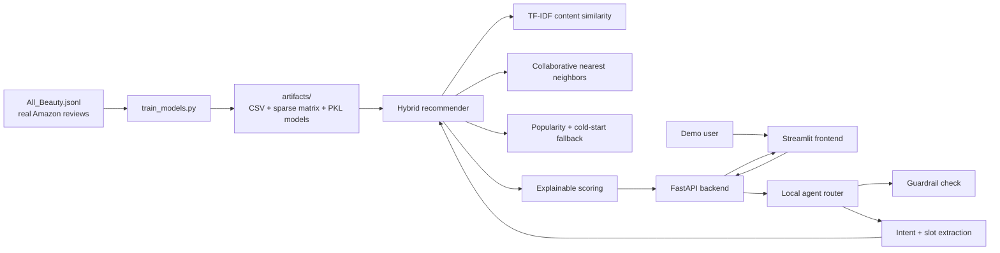

# System Architecture



## Training Flow

1. `train_models.py` reads the real Amazon Beauty review JSONL.
2. It cleans review text, review titles, ratings, ASINs, user IDs, timestamps, helpful votes, verified-purchase flags, and available review images.
3. It filters to sufficiently reviewed products and users with enough history for collaborative filtering.
4. It creates:
   - `product_df.csv`
   - `cf_interactions.csv`
   - `user_item_matrix.csv`
   - `user_item_sparse.npz`
   - `tfidf_vectorizer.pkl`
   - `content_nn_model.pkl`
   - `cf_model.pkl`
   - `demo_users.csv`
   - `metadata.json`

## Runtime Flow

1. The Streamlit app sends the selected user, query, and result count to `POST /agent/query`.
2. The local agent applies guardrails and routes the query.
3. The agent extracts structured hints such as category keywords and product IDs.
4. `recommender.py` loads the trained artifacts and computes scores.
5. The API returns recommendations, model stage, score breakdowns, guardrail status, and an agent trace.

## Ranking Formula

Known user:

```text
final_score = 0.34 * content_score
            + 0.28 * collaborative_score
            + 0.22 * query_score
            + 0.12 * popularity_score
            + 0.04 * category_boost
            - 0.22 * seen_item_penalty
```

Cold-start user:

```text
final_score = 0.52 * query_score
            + 0.42 * popularity_score
            + 0.06 * category_boost
```

## Data Limitation

The review file does not provide a reliable live product catalog with current names, prices, availability, or working product pages. To avoid fake precision, the frontend displays review-derived labels, ASINs, ratings, review counts, verified rate, helpful votes, available review images, and Amazon search links.

## Guardrails

The app blocks medical, diagnostic, prescription, and guaranteed-treatment requests. It can recommend beauty products based on review data, but it does not claim that products cure or treat medical conditions.
